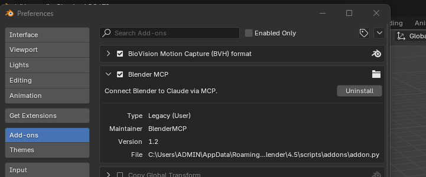
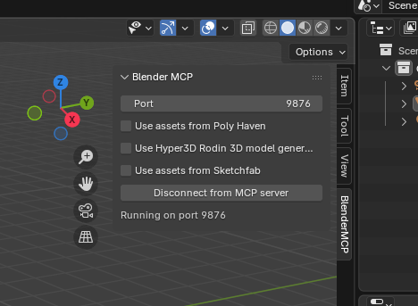

# Blender MCP Bridge

A Model Context Protocol (MCP) server for Blender, allowing AI agents to control Blender directly via Python commands.

## Table of Contents

*   [Installation](#installation)
*   [Usage](#usage)
*   [Technical Context](#technical-context)

## 🖥️ Installation

Below are instructions on how to install and set up the project.

1.  **Install the Add-on**:
    *   Open Blender.
    *   Go to `Edit > Preferences > Add-ons > Install...`.
    *   Select `addon.py` from this repository.
    *   Enable the add-on **"Blender MCP Bridge"**.
    *   
    *   Check the N-Panel (Right side of 3D Viewport) for the "Blender MCP" tab to ensure the server is running (Port `9876`).
    *   

2.  **Setup the Client**:
    *   **Generic Python**: Copy `client.py` to your project and import `BlenderClient`.
    *   **Google Antigravity**:
        *   Copy `client.py` into your agent's workspace folder (e.g., `antigravity/brain/...`).
        *   The Agent can then naturally import and use the client to "talk" to Blender.

## ✅ Connection & Verification

> [!IMPORTANT]
> **Always ensure the MCP server is running** in Blender (check the N-Panel) before attempting to send commands.

**Test Connection:**
To verify the IDE/Agent is correctly connected to Blender, try asking it to:
> "Create 5 random spheres with random sizes."

If the spheres appear in your Blender viewport, the connection is solid! 🟢

## 🚀 Usage

Below are instructions on how to use the bridge to control Blender.

**Basic Workflow:**
The agent generates Python code (using `bpy`) and sends it via the client.

```python
from client import BlenderClient

# 1. Connect to Blender
client = BlenderClient()

# 2. Define your script
script = """
import bpy
bpy.ops.mesh.primitive_cube_add()
"""

# 3. Execute
response = client.execute_code(script)
print(response)
```

## 🧠 Technical Context

Below are critical technical details for agents working with this bridge.

*   **Context & Selection**: Automatic execution often lacks `context.active_object`.
    *   *Rule*: Always explicitly set `bpy.context.view_layer.objects.active` and use `select_set(True)`.
*   **Booleans**: Use `solver='EXACT'` and ensure consistent normals for robust boolean operations.
*   **Cleanup**: Always use `try...finally` blocks when creating temporary geometry to keep the scene clean.

## 🤝 Support

If you have any questions or need assistance, feel free to reach out to me via LinkedIn:
[Sang Tran](https://www.linkedin.com/in/sang-tran-94686b160/)
